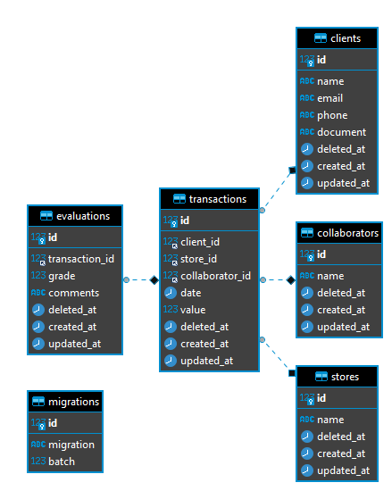

# SoluCX - Tech Test

This project is a Tech Test for the company SoluCX. \
It's developed in Lumen 5.8

## Configuration

Configure the `.env` for the application
```bash
  cd solucx-test
  cp .env.example .env
```

Run docker
```bash
  docker-compose up -d
```
PS: Docker might take some secounds to build, if you see an error on the following command, wait a couple secounds and try again.

Run migrations to build DB
```bash
  docker exec -it php php /var/www/html/artisan migrate
```

## API Documentation

Import the `./solucx-test.json` at Postman, Insomnia etc, to check project's APIs.


## DB MER

